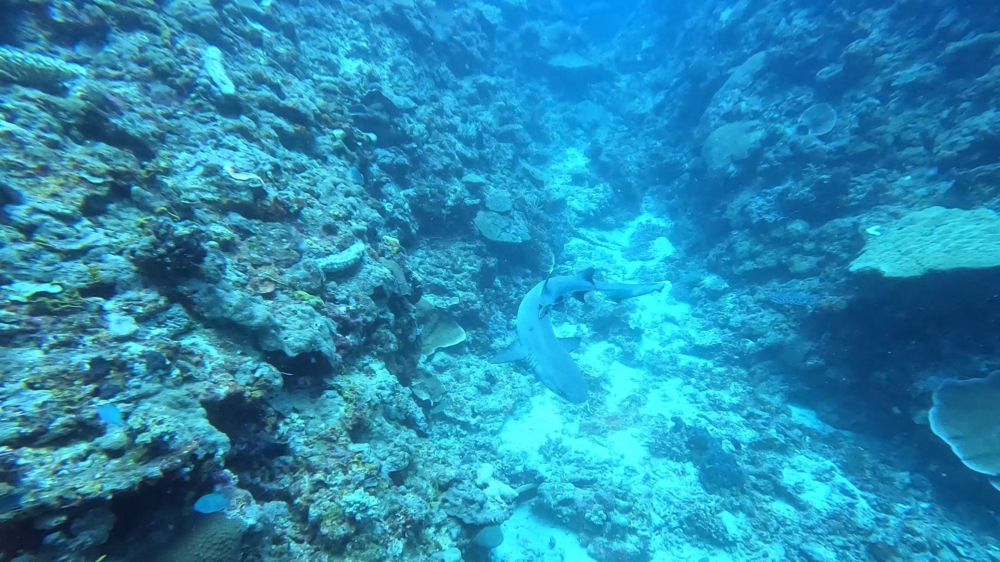
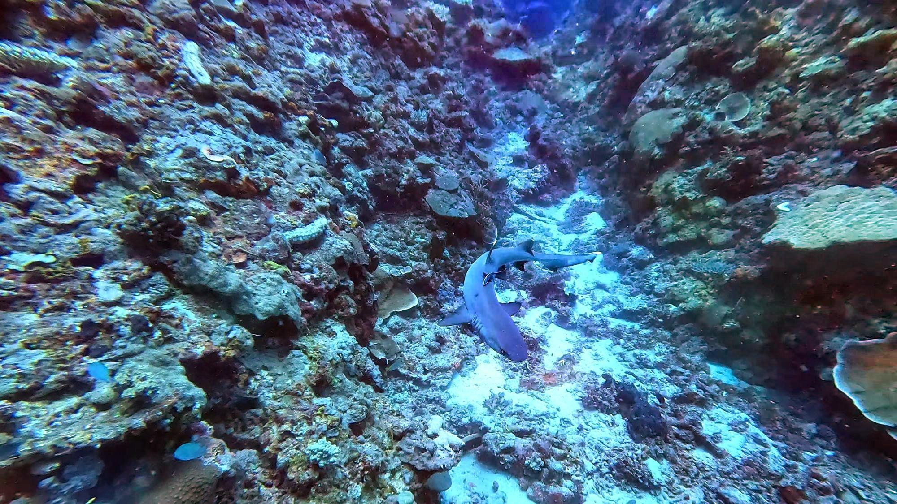
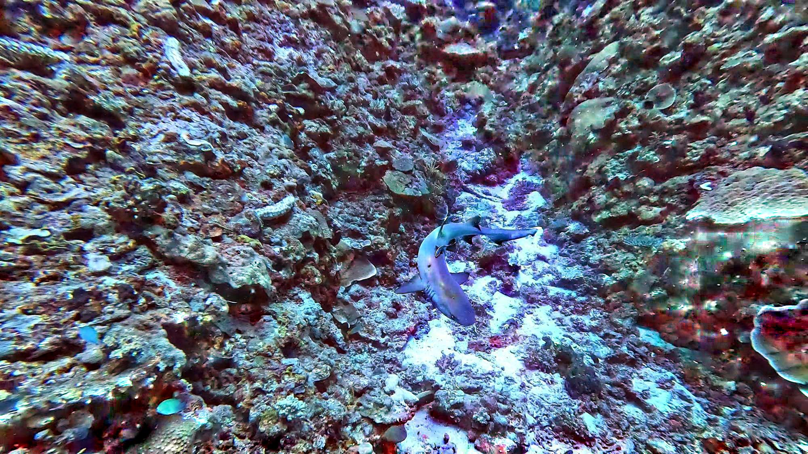

# UnderSee

## Introduction

This is a library and standalone tool
for color-correcting underwater imagery without extra metadata.
Water absorbs different colors of light at different rates,
and consumer cameras, like GoPros,
often do a poor job compensating for the change in overall color as they get deeper,
resulting in greened-out images.
Making matters worse,
objects that are closer often look redder than far-away objects,
so image-wide correction isn't generally enough to "restore" images
to something more like what the eye sees.

There are a bunch of good ways to compensate for these effects.
The best is to buy a big expensive camera
with a big expensive enclosure and several flashes,
and only take pictures of nearby subjects.
Next best: if you gather some 3d data,
you can calculate how far away each pixel is,
and therefore how much light was absorbed by the water.
This program doesn't do either of those things.

Instead, we try to stretch the color range of each channel locally,
so that each area uses the full dynamic range.
This has the advantage of not needing any extra information,
so it works on any image.
You can kind of think of it as taking a sloppy guess about the structure of the scene
based on the color range in each area,
and then doing the fancy compensation based on this wrong guess.
It works out surprisingly well,
as long as the user does the "hard part" of deciding exactly how local to be,
so the included UI provides a single slider.

So from a washed-out starting image like this:

You can get to something like this,
not perfect but much better:

But if you dial the locality up too far,
you end up approximating an edge detector,
and the result is a little eye-bleedy.

## Theory

We want to measure the dynamic range of each color channel around each pixel,
for values of "around" that range from the whole image to a small surrounding area.
To compute this cheaply, we construct a pair of
[image pyramids](https://docs.opencv.org/3.4/d4/d1f/tutorial_pyramids.html).
Each pixel in each of our pyramids represents the min (or max) value
of the four pixels in the larger image at the level below.
To construct a mapping for any given level,
we rescale the image at that level to the size of the original image,
using interpolation to avoid harsh edges between areas.

Then the mapping for each pixel is straightforward:
we subtract the minimum value from the pixel value,
then multiply by the (max - min) range.

This computation is independent for each color channel.

## Building

I've developed this on an Ubuntu machine,
and have not tested in other environments.
YMMV. That said, here's a list of things you need to install to get started:

- [qt5](https://wiki.qt.io/Install_Qt_5_on_Ubuntu)
- [bazel](https://bazel.build/install/ubuntu)
- [opencv](https://docs.opencv.org/4.x/d7/d9f/tutorial_linux_install.html)

Bazel should take care of other dependencies,
though you might have to fiddle a bit with the build rules
depending on where your local installations of qt and opencv end up.
